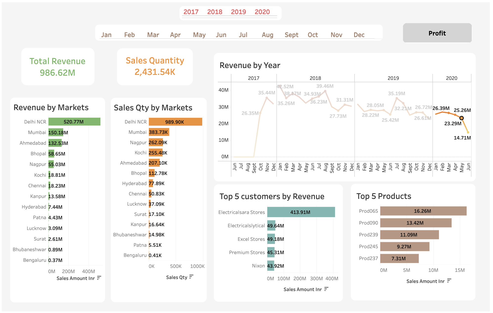
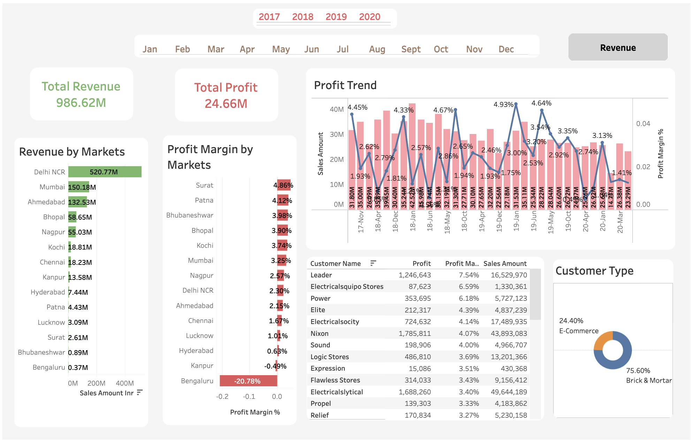

# 📊 Sales and Profit Analysis using SQL and Tableau

## 🔍 Project Overview
This project demonstrates an end-to-end business intelligence workflow, transforming raw transactional data into actionable insights using SQL and Tableau.

The analysis focuses on revenue and profit trends across markets, customers, and products.

## 🛠 Tools & Technologies
- SQL (MySQL Workbench)
- Tableau Public
- Data Modeling (Star Schema)

## 📁 Dataset Overview
- 150,000+ transaction records
- 5 tables (fact + dimension tables)
- Time period: 2017–2020

## ⚙️ Workflow
1. Data Cleaning & Preprocessing using SQL  
2. Data Modeling (Star Schema)  
3. Revenue & Profit Analysis  
4. Tableau Dashboard Creation  

## 📊 Key Insights
- Delhi NCR is the highest revenue-generating market (~520M)
- Top customer contributes a significant portion of revenue (risk of dependency)
- Profit margin varies across markets (some markets show losses)
- Revenue ≠ Profit (high sales doesn’t guarantee profitability)

##  📸 Dashboard Preview
🔗 Tableau Public Profile:  
https://public.tableau.com/app/profile/atul.dwivedi/vizzes

### Revenue Dashboard

### Profit Dashboard

## 💡 Business Recommendations
- Focus on high-revenue markets (Delhi NCR, Mumbai)
- Improve low-margin markets (Bangalore)
- Diversify customer base
- Track profit along with revenue

## 🚀 Future Improvements
- Sales forecasting (Time Series)
- Customer segmentation (RFM Analysis)
- Live dashboard integration

## 📌 Conclusion
This project highlights how structured SQL processing and Tableau dashboards can convert raw data into meaningful business insights for decision-making.
